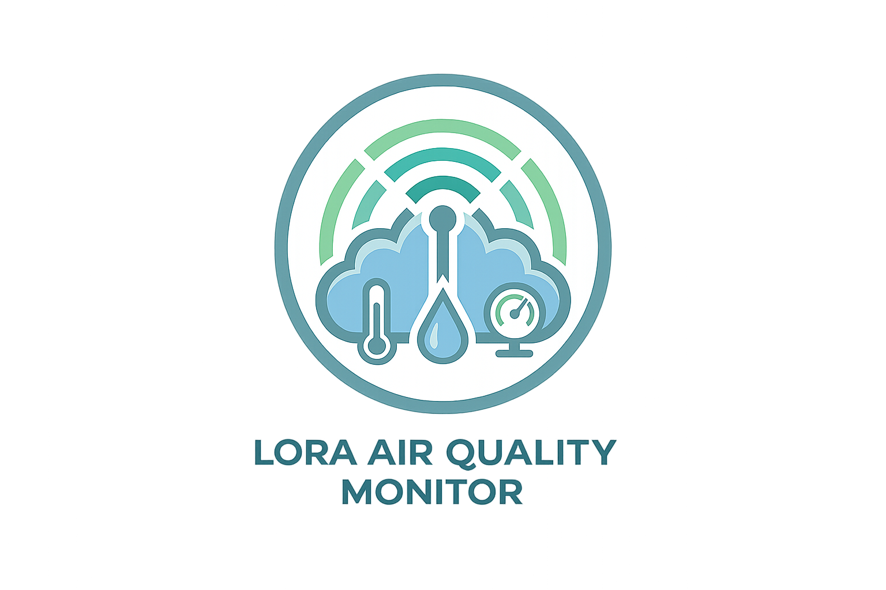

<div align="center">



# LoRa Air Quality Monitor

Professional-grade IoT platform for environmental monitoring using LoRaWAN, MQTT, InfluxDB and Grafana.

<br>

<div align="center">


&nbsp;&nbsp;

&nbsp;&nbsp;

&nbsp;&nbsp;

&nbsp;&nbsp;


<br>

[](https://opensource.org/licenses/MIT)
[](#)
[](#)
[](#)
[](#)


</div>

<br>


</div>

**LoRa Air Quality Monitor** is a professional-grade, end-to-end IoT solution designed for environmental monitoring in remote areas. By leveraging the long-range capabilities of **LoRa** technology, the efficiency of **MQTT**, and the power of time-series data with **InfluxDB**, this project provides a robust framework for tracking temperature, humidity, and atmospheric pressure across vast distances.

---

## 🚀 Overview

The system captures environmental data from remote end-devices (nodes) using LoRa modulation. These data packets are received by a central Gateway, which bridges the LoRa network to an IP network by publishing messages to a Mosquitto MQTT Broker. A dedicated subscriber service ingests these messages and persists them into InfluxDB for real-time analysis and visualization via Grafana.

### Key Features
- **Long Range Communication:** Utilizes LoRa for low-power, wide-area coverage.
- **Scalable Architecture:** Easily add more sensors or gateways.
- **Time-Series Optimized:** Efficient storage and querying of sensor data.
- **Containerized Stack:** Quick deployment using Docker and Docker Compose.
- **Real-time Monitoring:** Dashboard-ready data flow.

---

## 🏗️ System Architecture

```text
┌─────────────────┐       ┌─────────────────┐       ┌───────────────────┐
│  LoRa End Node  │       │  LoRa Gateway   │       │  MQTT Broker      │
│  (ESP32+SX1276) ├──────▶│ (Raspberry Pi/  ├──────▶│  (Mosquitto)      │
│  [Temp/Hum/Pres]│ LoRa  │  ESP32 Bridge)  │ MQTT  │                   │
└─────────────────┘       └─────────────────┘       └─────────┬─────────┘
                                                              │
                                                              │ Subscribe
                                                              ▼
┌─────────────────┐       ┌─────────────────┐       ┌───────────────────┐
│    Grafana      │       │    InfluxDB     │       │  Python Ingestor  │
│  (Dashboards)   │◀──────┤  (Time-Series)  │◀──────┤   (Subscriber)    │
└─────────────────┘       └─────────────────┘       └───────────────────┘
```

---

## 🛠️ Hardware Requirements

| Component | Description | Example |
|-----------|-------------|---------|
| **End Device** | Microcontroller with LoRa radio | ESP32 + SX1276 (Heltec WiFi LoRa 32 / TTGO LoRa32) |
| **Sensors** | Environmental sensors | BME280 (Temp, Humidity, Pressure) |
| **Gateway** | Bridge between LoRa and Internet | Raspberry Pi with LoRa HAT or ESP32 LoRa Gateway |
| **Power** | Battery or Solar for remote nodes | 18650 Li-ion batteries + Solar Panel |

---

## 💻 Software Stack

- **[Mosquitto](https://mosquitto.org/):** Lightweight MQTT message broker.
- **[InfluxDB 2.7](https://www.influxdata.com/):** High-performance time-series database.
- **[Python 3.x](https://www.python.org/):** Service logic for data ingestion.
- **[Docker](https://www.docker.com/):** Containerization and orchestration.
- **[Grafana](https://grafana.com/):** (Optional) Visualization platform.

---

## 📂 Project Structure

```text
.
├── config/
│   └── mosquitto.conf      # MQTT Broker configuration
├── docker/
│   └── docker-compose.yml  # Infrastructure orchestration
├── docs/
│   └── architecture.png    # High-level diagram
├── gateway/
│   └── subscriber.py       # MQTT-to-InfluxDB bridge script
└── README.md
```

---

## 🔧 Installation & Configuration

### Prerequisites
- Docker and Docker Compose installed.
- Python 3.10+ (for the subscriber script).
- Basic knowledge of LoRa and MQTT.

### Step 1: Spin up the Infrastructure
Navigate to the `docker/` directory and start the services:

```bash
cd docker
docker-compose up -d
```

This will launch **Mosquitto**, **InfluxDB**, and **Grafana**.

### Step 2: Configure InfluxDB
By default, the `docker-compose.yml` initializes InfluxDB with the following credentials:
- **Org:** `my-org`
- **Bucket:** `lora_data`
- **Token:** `my-super-secret-auth-token`

### Step 3: Install Python Dependencies
For the ingestion script, install the required libraries:

```bash
pip install paho-mqtt influxdb-client
```

---
##   MQTT Topic Structure & Payload

### Topic Pattern

The gateway should publish data to the following topic:
`lora/devices/{device_id}/data`

### Example Payload (JSON)
```json
{
  "temperature": 24.5,
  "humidity": 55.2,
  "pressure": 1013.2,
  "location": "field-alpha-01"
}
```

---

##  InfluxDB Data Schema

The `subscriber.py` script maps MQTT messages to InfluxDB as follows:

- **Bucket:** `lora_data`
- **Measurement:** `sensor_data`
- **Tags:**
  - `device_id`: The ID extracted from the MQTT topic.
  - `location`: The location field from the JSON payload.
- **Fields:**
  - `temperature` (float)
  - `humidity` (float)
  - `pressure` (float)

---
##  Ingestion Script (Subscriber)

The `gateway/subscriber.py` is the bridge between MQTT and InfluxDB. 

**Brief Explanation:**
1. It connects to the Mosquitto broker and subscribes to `lora/devices/+/data`.
2. When a message arrives, it parses the JSON payload.
3. It creates an InfluxDB `Point` and writes it synchronously to the database.

**To run the subscriber:**
```bash
python gateway/subscriber.py
```

---

## 📈 Usage & Visualization

### Querying Data (Flux)
You can verify data in the InfluxDB UI (localhost:8086) or via CLI using Flux:

```flux
from(bucket: "lora_data")
  |> range(start: -1h)
  |> filter(fn: (r) => r["_measurement"] == "sensor_data")
  |> filter(fn: (r) => r["_field"] == "temperature")
```

##  Grafana Integration

1. Login to Grafana at `http://localhost:3000` (Default: admin/admin).
2. Add a **Data Source**: Select **InfluxDB**.
3. Set Query Language to **Flux**.
4. URL: `http://influxdb:8086`.
5. Enter Org, Token, and Bucket details from Step 2.
6. Create a dashboard and add a Time Series panel.

<p align="center">
  
</p>

---

## ❓ Troubleshooting

- **Connection Refused (MQTT):** Ensure the `mosquitto.conf` allows connections and the container is running.
- **LoRa Packet Loss:** Check the distance between nodes and the gateway, or adjust Spreading Factor (SF).
- **InfluxDB Authentication:** Verify that the token in `subscriber.py` matches the one in `docker-compose.yml`.
- **JSON Parsing Error:** Ensure the LoRa Gateway is sending a valid, uncorrupted JSON string.

---

## 🤝 Contributing

Contributions make the IoT community a better place!
1. Fork the Project.
2. Create your Feature Branch (`git checkout -b feature/AmazingFeature`).
3. Commit your Changes (`git commit -m 'Add some AmazingFeature'`).
4. Push to the Branch (`git push origin feature/AmazingFeature`).
5. Open a Pull Request.

---

## 📜 License

Distributed under the MIT License. See `LICENSE` for more information.

---
*Developed with ❤️ for the IoT community.*