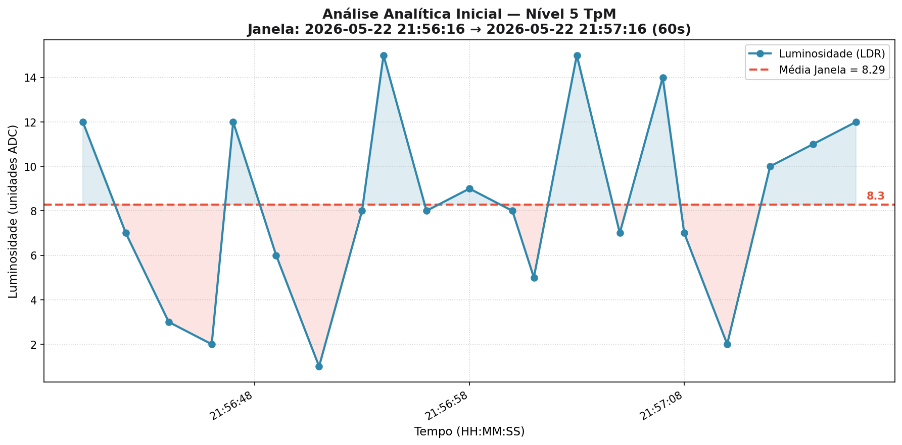

# 📡 LoRa → MQTT → Python (Request-Response IoT)


Sistema de comunicação e análise IoT baseado em **LoRa + MQTT**, com lógica de controle e processamento de dados em lotes implementada em Python (Níveis 1 a 5 da Metodologia TpM).

---

## 🚀 Visão Geral

Este projeto implementa um fluxo completo de comunicação e análise de dados entre:

- 📟 **Sensor LoRa (ESP32 + LDR)** → envia dados de luminosidade.
- 🌐 **Broker MQTT (HiveMQ)** → intermedia mensagens na nuvem.
- 🧠 **Elemento de borda (Nível 4)** → processa dados em tempo real, envia comandos de controle e salva histórico.
- 📊 **Processamento (Nível 5)** → script independente que processa os dados armazenados em lote, filtra janelas de tempo e extrai *insights* visuais.

A arquitetura segue um modelo **request-response síncrono**, garantindo controle determinístico sobre o comportamento do dispositivo remoto.

---

## 🧠 Lógica do Sistema

O cliente Python (`mqtt_client.py`):

1. Envia uma requisição ao sensor.
2. Aguarda resposta (com timeout).
3. Processa a luminosidade recebida.
4. Decide o estado do LED.
5. Envia o próximo comando e salva os dados localmente.

### 📊 Regra de decisão (Controle do LED)

| Luminosidade | Ação |
|--------------|------|
| `< LIMIAR`   | LED Vermelho 🔴 |
| `>= LIMIAR`  | LED Amarelo 🟡 |

---

## 🏗️ Arquitetura


---

## 📦 Tecnologias Utilizadas

- Python 3.13  
- Biblioteca MQTT: `paho-mqtt`  
- Visualização de Dados: `matplotlib`
- Broker público: `broker.hivemq.com`  
- Comunicação IoT via LoRa (ESP32 + RFM95)  

---

## 📁 Estrutura do Projeto


```

lora_mqtt/
├── computador/
│   ├── mqtt_client.py      # Elemento de borda (Nível 3) e persistência (Nível 4)
│   ├── analise_dados.py    # Processamento Analítico Básico (Nível 5)
│   └── dados/              # Diretório gerado quando executar mqtt_client.py
├── test/
│   └── fake_sensor.py      # Gerador de massa de dados falsos para testes
├── requirements.txt
└── README.md

```

> ⚠️ O diretório `venv/` e `dados/` não deve ser versionado (adicione ao `.gitignore`)

---

## ⚙️ Configuração

### 1. Clone o repositório

```bash
git clone <repo-url>
cd lora_mqtt

```

### 2. Crie um ambiente virtual

```bash
python -m venv venv

# Linux/macOS
source venv/bin/activate

# Windows
venv\\Scripts\\activate

```

### 3. Instale as dependências

```bash
pip install -r requirements.txt

```

---

## 4. Configurações de Rede (Hardware)

### 📁 4.1. Criar o arquivo de configuração

Renomeie o arquivo base no código do microcontrolador:

```bash
secrets.h.template → secrets.h

```

### ✏️ 4.2. Preencher as credenciais

```c
// Credenciais do seu WiFi   
const char* ssid     = "NOME_DA_SUA_REDE";
const char* password = "SENHA_DA_SUA_REDE";

```

### 🌐 4.3. Configuração do Broker MQTT

Você pode usar um broker público (já configurado por padrão):

```c
const char* mqtt_server = "broker.hivemq.com";
const int mqtt_port     = 1883;

```

### 📡 4.4. Tópicos MQTT

```c
const char* topic_DL = "sensor/led";
const char* topic_UL = "sensor/luminosidade";

```

🔎 **O que isso significa:**

* `topic_UL` → onde o gateway envia dados (Uplink).
* `topic_DL` → onde o gateway recebe comandos (Downlink).

### 🚨 Erros comuns

* ❌ Esquecer as aspas `"..."`.
* ❌ Colocar espaço no final do nome da rede.
* ❌ Usar WiFi 5GHz (pode não funcionar dependendo do hardware do ESP).
* ❌ Digitar senha incorreta.

---

## 🔧 Configurações do MQTT Client

No arquivo `mqtt_client.py`:

```python
BROKER = "broker.hivemq.com"
TOPIC_LUM = "sensor/luminosidade"
TOPIC_LED = "sensor/led"

LIMIAR = 2000
TIMEOUT_RESPOSTA = 10.0

```

---

## ▶️ Execução e Testes do Sistema de Controle

Você pode testar a aplicação de ponta a ponta localmente utilizando o gateway com recebimento de dados simulado, portanto sem a necessidade do hardware físico.

### Passo 1: Inicializar o Sensor Fake

Em um terminal dedicado, execute o gerador de dados (ele criará massa de dados para análise):

```bash
python test/fake_sensor.py

```

### Passo 2: Inicializar o Cliente Principal

Em outro terminal, execute o script do ecossistema de controle e armazenamento:

```bash
python computador/mqtt_client.py

```

---

## 💾 Armazenamento Local (Persistência JSON) - Nível 4

Ao receber respostas válidas, o sistema gera de forma automática uma pasta chamada `dados/` no mesmo diretório do arquivo executado e armazena os dados sob o seguinte formato estruturado:

```json
[
    {
        "date": "2026-10-05 12:30:01",
        "luminosidade": 1234
    }
]

```

Esta implementação atende ao **Nível 4** de maturidade da TpM, viabilizando o processamento em lotes (Nível 5).

---

## 📈 Processamento Analítico Básico - Nível 5

Para extrair *insights* focados, o projeto conta com um script de processamento em lote que consome os arquivos da pasta `dados/`, filtra fatias temporais específicas e plota gráficos informativos com a média da luminosidade estrita ao período analisado.



### Executando a Análise

Para analisar os dados salvos:

```bash
python computador/analise_dados.py

```

### Argumentos opcionais suportados:

* **`--janela` ou `--duracao**`: Define o tamanho da janela temporal em segundos (padrão: 60s).
```bash
python computador/analise_dados.py --janela 30

```


* **`--inicio`**: Define o ponto de partida temporal específico (formato `"YYYY-MM-DD HH:MM:SS"`).
```bash
python computador/analise_dados.py --inicio "2026-05-23 14:30:00" --duracao 60

```


* **`--no-save`**: Exibe o gráfico, mas não salva a imagem `.png` em disco.

---

## 📡 Protocolo de Comunicação

### 📤 Requisição (Python → Sensor)

* Pacote de 52 bytes
* Byte relevante:
* `byte[34]`: comando do LED


### 📥 Resposta (Sensor → Python)

* Pacote de 52 bytes
* Bytes relevantes:
* `byte[17-18]`: valor de luminosidade (`uint16`)


---

## 🔁 Modo de Operação

O sistema roda em loop contínuo:

1. Envia pacote
2. Aguarda resposta (`threading.Event`)
3. Timeout de segurança (10s)
4. Reenvio automático

* ✔ Evita flooding
* ✔ Garante sincronização
* ✔ Detecta falhas de comunicação

---

## 🧵 Concorrência

O projeto utiliza:

* `threading.Thread` → envio contínuo.
* `threading.Event` → sincronização entre envio e resposta.

Implementando um padrão robusto de **controle síncrono sobre rede assíncrona**.

---

## ⚠️ Pontos de Atenção

* Uso de broker público (sem autenticação).
* Sem criptografia (MQTT plain).
* Dependência de conectividade estável.
* Pacote binário fixo (hardcoded).

---

## 💡 Possíveis Melhorias

* 🔐 TLS + autenticação MQTT.
* 📊 Persistência de dados escalável (InfluxDB, PostgreSQL).
* 🌍 Dashboards em Tempo Real (Nível 6 TpM - Grafana / Web UI).
* 📦 Serialização estruturada (CBOR / Protobuf).
* 🔄 QoS MQTT configurável.

---

## 🧪 Cenário de Uso

Ideal para:

* Projetos acadêmicos de IoT e análise de dados.
* Testes com LoRaWAN / gateways próprios.
* Prototipação de sistemas embarcados distribuídos.
* Estudos de comunicação assíncrona controlada e processamento em lote.

---

## 📄 Licença

Este projeto está licenciado sob a licença MIT — veja o arquivo `LICENSE` para mais detalhes.

Você é livre para usar, modificar e distribuir este projeto para fins de estudo e ensino.
